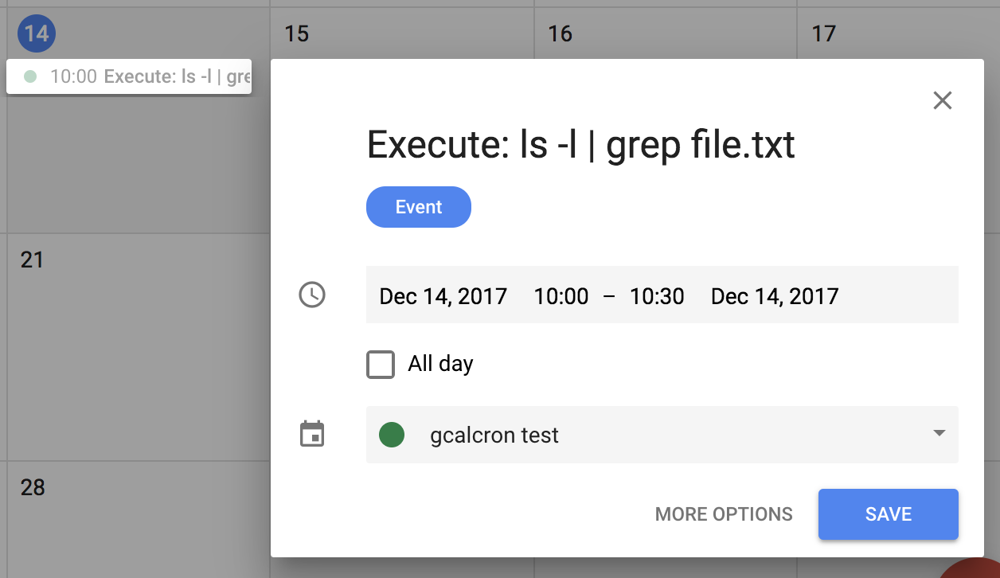

# gcalcron

> Schedule shell commands execution through Google Calendar

`Google Calendar` + `Cron` + `Node.js`

## Super fast usage example

Start gcalcron:

```
$ gcalcron start '0 0 10 * * *'

[INFO] Process started checking your calendar: 10:00:00 every day
```

Insert an event starting at 10:00 through Google Calendar:



Back in the terminal:

```
[INFO] Executed: 'ls -l | grep file.txt'
-rw-r--r--    1 antonio  1796131739     11 Sep 24 15:14 file.txt
```

## Installation

Install it as a global module:

```
$ npm install -g gcalcron
```

## Usage

1. Authenticate the app
2. Start `gcalcron`, setting the check interval using cron syntax
3. Schedule tasks inserting events in your calendar

### 1. Authentication

Authorization and authentication is done with OAuth 2.0. 

Ok, this will take only about 2 minutes:

#### 1.1 Get your project credentials

You will need a file with your credentials: `client ID`, `client secret` and `redirect URI`. This can be obtained in the [Developer Console](https://console.developer.google.com):

- Go to your project
- Click in `Credentials`
- Click `Create credentials` → `OAuth client ID` (`Application type` must be `Other`)
- Download the JSON file

#### 1.2 Generate consent page URL

Once we got the credentials we must generate a consent page URL.

```
$ gcalcron generateUrl
```

([By default](#setting-your-own-config), the credentials will be searched in your home directory under the name `client_secret.json`)

The page will prompt you to authorize access, follow the instructions.

#### 1.3 Get the token!

With the code we got through the authorization page, we can obtain a token and store it in our machine.

```
$ gcalcron storeToken <code>
```

([By default](#setting-your-own-config), the token is stored in your home folder under the name `calendar_api_token.json`). 

NOTE: The token will expiry after one hour, but a `refresh_token` is included as well, allowing the app to refresh automatically the token each time it's used.

With this we are good to go. The stored token and credentials files will be required from now on to use this tool.

### 2. Start gcalcron

Syntax:

```
gcalcron start <cron-time> [--out <file> --err <file>]
```

`<cron-time>` must be in the form of cron syntax, with this the check frequency will be set.

`--out <file>` and `--err <file>` are optional, executed commands output and error output can be set using these options. By default, `stdio` and `sterr` will be used.

The next example will check your Google Calendar every hour printing the executed commands output in a text file:

```
$ gcalcron start '0 0 * * * *' --out ./output.txt
```

The Cron functionality is powered by [node-cron](https://github.com/kelektiv/node-cron), for more info about the syntax check the repository README.

### 3. Schedule tasks through Google Calendar

#### Event title

The events have to start with `Execute: `, followed by the shell command you want to execute.

```
Execute: /some/random/script.sh
```

#### Event description

The command can be specified in the event description instead, in case the description has content, the command in the title will be ignored.

NOTE: `Execute:` must be written always, what is ignored is whatever is written after `Execute:`.

#### Event start and end time

The range of time when the command will be executed. It will be executed only once, after it's executed the title of the event is renamed to from `Execute: foo` to `[Executed] foo`.

Recurring events will be executed once per occurrence.

NOTE: If, for example, an event is set from 20:00 to 21:00, you have to make sure that `gcalcron` is going to check your calendar at least once per hour.

## Setting your own config

Using the option `-C <file>` you can set your own config. This file must be `.js` or `.json`.

**Example:**

`/somepath/config.json`
```json
{
  "CRED_PATH": "/my/secret/path/credentials.json",
  "TOKEN_PATH": "/my/secret/path/token.json",
}
```

```
$ gcalcron -C /somepath/config.json generateUrl

$ gcalcron -C /somepath/config.json storeToken 1249asdjasop12

$ gcalcron -C /somepath/config.json start "0,30 * * * * *"
```

With the above config your token will be stored in `/my/secret/path/credentials.json`, and your token and credentials will be read from there as well.

**The available options are:**

### CRED_PATH

Path to your credentials file. (Default: located in your home directory under the name `client_secret.json`)

### TOKEN_PATH

Path to your token. (Default: located in your home directory under the name `calendar_api_token.json`)

### CALENDAR_ID

The ID of the calendar you want to use. (Default: `primary` calendar)

### LIST_ORDER

In case there are several events to be executed, this set the execution order (always ascending). Acceptable values are `updated` and `startTime`. (Default: `startTime`)

### OUT_PATH

Write command output to a an specified file. (Default: `stdout`).

Same as the option `-o, --output <file>`. In case both are set, the option has preference.

### ERR_PATH

Write command errors to a an specified file. (Default: `stderr`)

Same as the option `-e, --error <file>`. In case both are set, the option has preference.

### SHELL

Shell to execute the command with. (Default: `/bin/sh` on UNIX, `process.env.ComSpec` on Windows)

## API

Use the `help` command.

**`$ gcalcron help`**

## Considerations

- Use it under your own risk, if your Google Calendar account is compromised, malicious code could be executed.
- The Google Calendar API has a [limit](https://developers.google.com/google-apps/calendar/pricing) of 1,000,000 queries per day, so it should be enough even if the check is executed once per second.
- If you want to keep the process alive, consider using some tools like [PM2](https://github.com/Unitech/pm2) or [forever](https://github.com/foreverjs/forever).

## Related

`gcalcron` can be used altogether with [gcal](https://github.com/toniov/gcal-cli) to insert events programmatically. They share the same authentication process, so you can get to use it out-of-the-box.

## License

MIT © [Antonio V](https://github.com/toniov)
